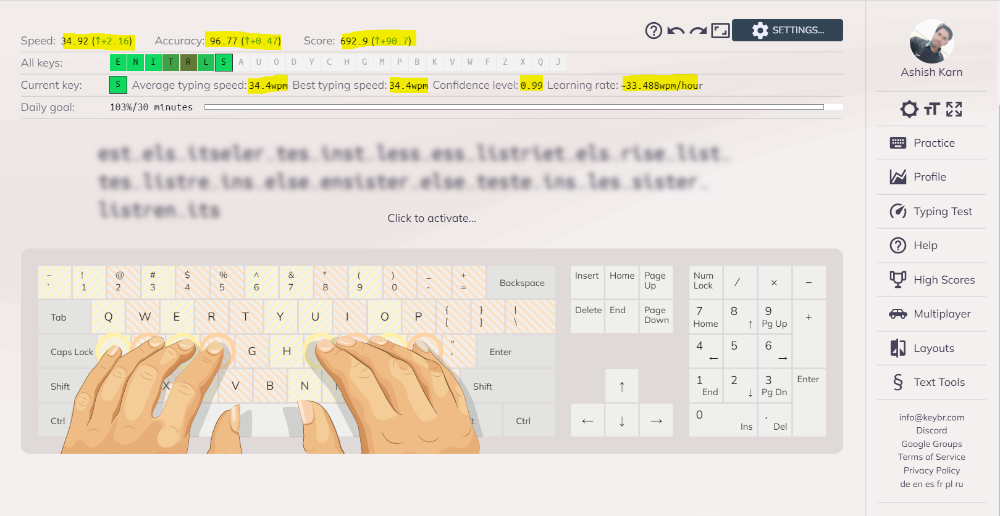
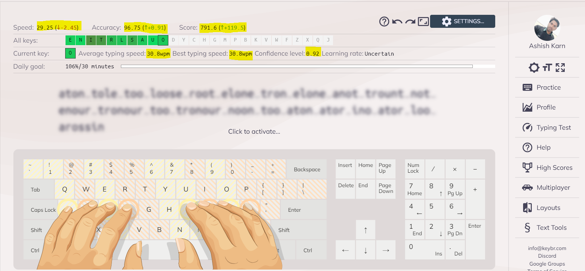
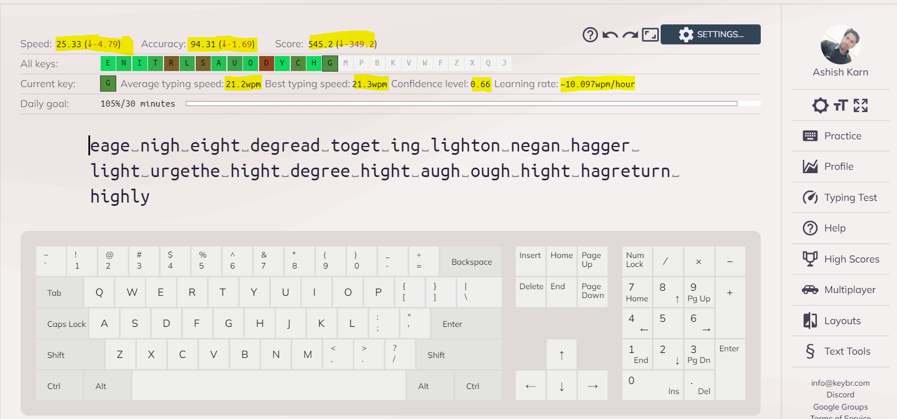

# 90-days-typing-practice

This repository contains screen shots and details related to each day minimum 30 min of typing practice. 
On 1st day, I have maintain a typing speed of 34 wpm/hour. 
So, will update this repository details on last day with screen shot.

Profile details with all time statistic is available on [Ashish Karn - KeyBr](https://www.keybr.com/profile/64w45d6) 

## Day 1: February 11, 2022. #90DaysofTypingPractice
- My current progress is **34 wpm/hour**:

## Day 2: February 12, 2022. #90DaysofTypingPractice
- My current progress is **30 wpm/hour**:

## Day 3: February 13, 2022. #90DaysofTypingPractice
- My current progress is **19 wpm/hour**:

## Day 4: February 14, 2022. #90DaysofTypingPractice
- My current progress is **21 wpm/hour**:

