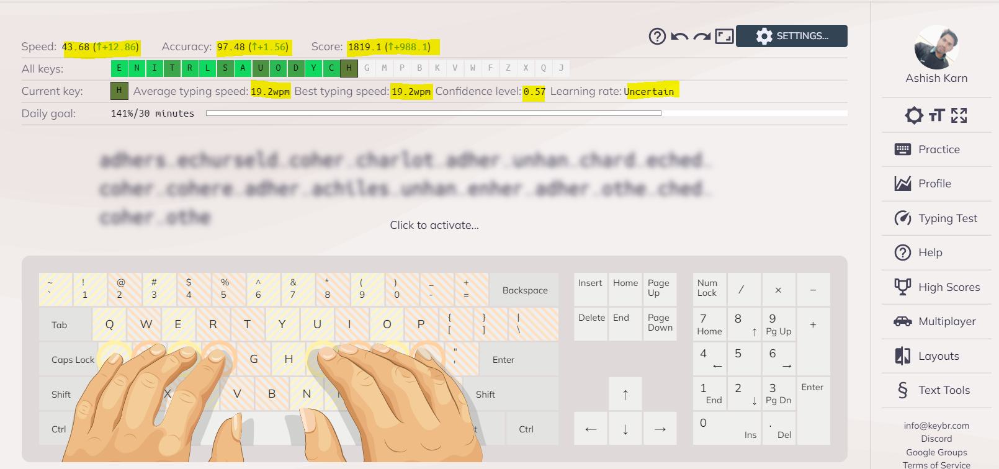
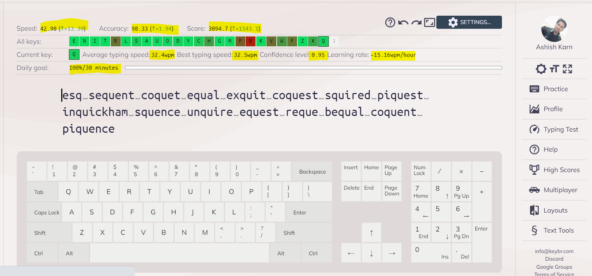

# 90-days-typing-practice

This repository contains screen shots and details related to each day minimum 30 min of typing practice. 
On 1st day, I have maintain a typing speed of 34 wpm/hour. 
So, will update this repository details on last day with screen shot.

Profile details with all time statistic is available on [Ashish Karn - KeyBr](https://www.keybr.com/profile/64w45d6) 

## Day 1: February 11, 2022. #90DaysofTypingPractice
- My current progress is with speed of **34 wpm/hour**:

## Day 2: February 12, 2022. #90DaysofTypingPractice
- My current progress is with speed of **30 wpm/hour**:

## Day 3: February 13, 2022. #90DaysofTypingPractice
- My current progress is with speed of **19 wpm/hour**:

## Day 4: February 14, 2022. #90DaysofTypingPractice
- My current progress is with speed of **21 wpm/hour**:

## Day 5: February 15, 2022. #90DaysofTypingPractice
- My current progress is with speed of **21 wpm/hour**:

## Day 6: February 16, 2022. #90DaysofTypingPractice
- My current progress is with speed of **24 wpm/hour**:

## Day 7: February 17, 2022. #90DaysofTypingPractice
- My current progress is with speed of **33 wpm/hour**:

## Day 8: February 18, 2022. #90DaysofTypingPractice
- My current progress is with speed of **32 wpm/hour**:

## Day 9: February 19, 2022. #90DaysofTypingPractice
- My current progress is with speed of **26 wpm/hour** and with an accuracy of **95.8%**:

## Day 10: February 20, 2022. #90DaysofTypingPractice
- My current progress is with speed of **33.91 wpm/hour** and with an accuracy of **97.56%**:

## Day 11: February 21, 2022. #90DaysofTypingPractice
- My current progress is with speed of **29.54 wpm/hour** and with an accuracy of **97.37%**:

## Day 12: February 22, 2022. #90DaysofTypingPractice
- My current progress is with speed of **28.9 wpm/hour** and with an accuracy of **93.91%**:

## Day 13: February 23, 2022. #90DaysofTypingPractice
- My current progress is with speed of **35.96 wpm/hour** and an accuracy of **100%**:

## Day 14: February 24, 2022. #90DaysofTypingPractice
- My current progress is with speed of **40.76 wpm/hour** and an accuracy of **96.52%**:

## Day 15: February 25, 2022. #90DaysofTypingPractice
- My current progress is with speed of **32.54 wpm/hour** and an accuracy of **94.12%**:

## Day 16: February 28, 2022. #90DaysofTypingPractice
- My current progress is with speed of **35.7 wpm/hour** and an accuracy of **98.37%**:

## Day 17: March 01, 2022. #90DaysofTypingPractice
- My current progress is with speed of **26.95 wpm/hour** and an accuracy of **96.75%**:

## Day 18: March 02, 2022. #90DaysofTypingPractice
- My current progress is with speed of **33.22 wpm/hour** and an accuracy of **96.83%**:

## Day 19: March 04, 2022. #90DaysofTypingPractice
- My current progress is with speed of **40.38 wpm/hour** and an accuracy of **97.54%**:

## Day 20: March 05, 2022. #90DaysofTypingPractice
- My current progress is with speed of **34.45 wpm/hour** and an accuracy of **98.29%**:

## Day 21: March 06, 2022. #90DaysofTypingPractice
- My current progress is with speed of **34.77 wpm/hour** and an accuracy of **99.15%**:

## Day 22: March 07, 2022. #90DaysofTypingPractice
- My current progress is with speed of **25.95 wpm/hour** and an accuracy of **95.58%**:

## Day 23: March 08, 2022. #90DaysofTypingPractice
- My current progress is with speed of **33.03 wpm/hour** and an accuracy of **98.26%**:

## Day 24: March 09, 2022. #90DaysofTypingPractice
- My current progress is with speed of **42.98 wpm/hour** and an accuracy of **98.33%**:

## Day 25: March 10, 2022. #90DaysofTypingPractice
- My current progress is with speed of **32.32 wpm/hour** and an accuracy of **98.23%**:

## Day 26: March 11, 2022. #90DaysofTypingPractice
- My current progress is with speed of **36.71 wpm/hour** and an accuracy of **97.58%**:

## Day 27: March 12, 2022. #90DaysofTypingPractice
- My current progress is with speed of **32.25 wpm/hour** and an accuracy of **97.46%**:

## Day 28: March 13, 2022. #90DaysofTypingPractice
- My current progress is with speed of **37.89 wpm/hour** and an accuracy of **98.36%**:

## Day 29: March 14, 2022. #90DaysofTypingPractice
- My current progress is with speed of **38.23 wpm/hour** and an accuracy of **98.39%**:

## Day 30: March 15, 2022. #90DaysofTypingPractice
- My current progress is with speed of **40.38 wpm/hour** and an accuracy of **97.62%**:

## Day 31: March 17, 2022. #90DaysofTypingPractice
- My current progress is with speed of **39.84 wpm/hour** and an accuracy of **97.54%**:

## Day 32: March 18, 2022. #90DaysofTypingPractice
- My current progress is with speed of **44.1 wpm/hour** and an accuracy of **96.69%**:

## Day 33: March 19, 2022. #90DaysofTypingPractice
- My current progress is with speed of **34.15 wpm/hour** and an accuracy of **99.17%**:

## Day 34: March 20, 2022. #90DaysofTypingPractice
- My current progress is with speed of **36.69 wpm/hour** and an accuracy of **98.36%**:

## Day 35: March 21, 2022. #90DaysofTypingPractice
- My current progress is with speed of **41.23 wpm/hour** and an accuracy of **99.28%**:

## Day 36: March 22, 2022. #90DaysofTypingPractice
- My current progress is with speed of **41.8 wpm/hour** and an accuracy of **100%**:

## Day 37: March 23, 2022. #90DaysofTypingPractice
- My current progress is with speed of **41.71 wpm/hour** and an accuracy of **95.83%**:

## Day 38: March 24, 2022. #90DaysofTypingPractice
- My current progress is with speed of **41.85 wpm/hour** and an accuracy of **96.77%**:

## Day 39: March 25, 2022. #90DaysofTypingPractice
- My current progress is with speed of **48.87 wpm/hour** and an accuracy of **98.36%**:

## Day 40: March 26, 2022. #90DaysofTypingPractice
- My current progress is with speed of **45.4 wpm/hour** and an accuracy of **98.36%**:

## Day 41: March 28, 2022. #90DaysofTypingPractice
- My current progress is with speed of **46.93 wpm/hour** and an accuracy of **99.19%**:

## Day 42: March 29, 2022. #90DaysofTypingPractice
- My current progress is with speed of **50.6 wpm/hour** and an accuracy of **99.19%**:

## Day 43: March 30, 2022. #90DaysofTypingPractice
- My current progress is with speed of **40.03 wpm/hour** and an accuracy of **98.37%**:

## Day 44: March 31, 2022. #90DaysofTypingPractice
- My current progress is with speed of **43.16 wpm/hour** and an accuracy of **97.5%**:

## Day 45: April 01, 2022. #90DaysofTypingPractice
- My current progress is with speed of **48.68 wpm/hour** and an accuracy of **99.23%**:

## Day 46: April 02, 2022. #90DaysofTypingPractice
- My current progress is with speed of **44.32 wpm/hour** and an accuracy of **97.52%**:

## Day 47: April 03, 2022. #90DaysofTypingPractice
- My current progress is with speed of **48.53 wpm/hour** and an accuracy of **98.39%**:

## Day 48: April 04, 2022. #90DaysofTypingPractice
- My current progress is with speed of **44.02 wpm/hour** and an accuracy of **96.77%**:

## Day 49: April 06, 2022. #90DaysofTypingPractice
- My current progress is with speed of **43.02 wpm/hour** and an accuracy of **97.67%**:

## Day 50: April 07, 2022. #90DaysofTypingPractice
- My current progress is with speed of **49.75 wpm/hour** and an accuracy of **99.17%**:

## Day 51: April 09, 2022. #90DaysofTypingPractice
- My current progress is with speed of **51.38 wpm/hour** and an accuracy of **98.35%**:

## Day 52: April 10, 2022. #90DaysofTypingPractice
- My current progress is with speed of **43.79 wpm/hour** and an accuracy of **97.62%**:

## Day 53: April 11, 2022. #90DaysofTypingPractice
- My current progress is with speed of **56.19 wpm/hour** and an accuracy of **100%**:

